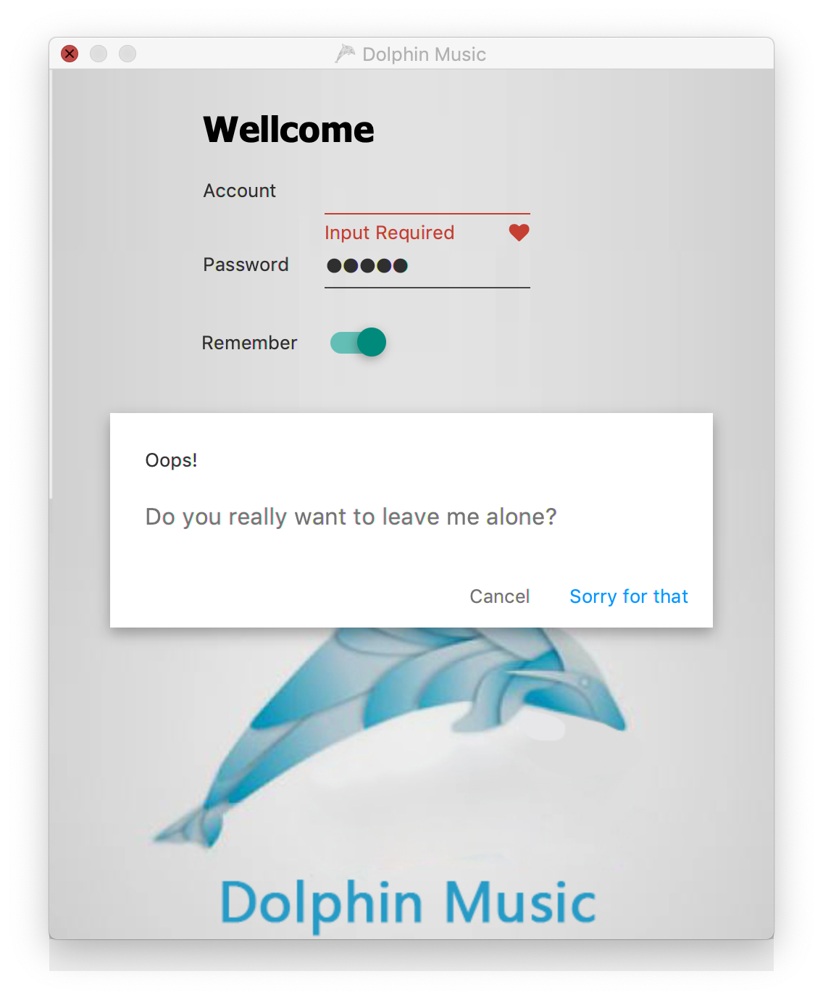

# Dolphin Music

#### 介绍
Dolphin Music 海豚音乐，取意：听到海豚才能听到的高音。

#### 软件架构
SpringBoot  
JavaFx  
Jfoenix  
MybatisPlus  
SpringDataJpa(用于自动生成、更新表)

#### 说明
可以爬取【网c易h云i音n乐a】的歌曲，使用多线程，爬取效率高。
界面上模拟 Android系统扁平化UI。
添加动态启动动画，SpringBoot 项目完全启动时结束，避免初始界面获取 SpringIoC 容器中的对象时报 NPE。
可打包生成 Windows 的 exe 执行文件、MacOS 的 dmg、app、 和 jar 软件包运行。打包时内嵌jre。

#### Future
后期界面加入按歌曲名、歌手搜索。
由于前期没有挂vpn，ip被【ban】，进度缓慢。

#### 截图
  
  
  
  

<video id="video" controls="" preload="none" poster="http://media.w3.org/2010/05/sintel/poster.png">
    <source id="mp4" src="./readme/login.mov" type="video/mp4">
    <source id="webm" src="http://media.w3.org/2010/05/sintel/trailer.webm" type="video/webm">
    <source id="ogv" src="http://media.w3.org/2010/05/sintel/trailer.ogv" type="video/ogg">
    
Your user agent does not support the HTML5 Video element.

</video>